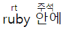

## HTML 페이지
- \<!DOCTYPE html> : HTML5 문서를 표시하는 지시어
- \<!--"내용"--> : 주석문 작성하는 부분으로 화면에 출력하지 않는다.
- \<html>, \<head>, \<title>, \<body> : 시작/종료 태그가 모두 존재하며, HTML5 구조를 나타내는 필수 태그

### HTML 태그 구성
```HTML

<!-- 
    img : 태그 이름
    src : 속성 이름
    "heart.jpg" : 속성 값
    width="100", height="50", alt="사랑합니다" 속성(속성 이름/값)
    속성 값에 불필요한 공백 문자는 HTML 표준에 어긋난다.
-->
```

### 주요 태그
- \<hn>\</hn> 태그 : 제목 표시를 하며, n에 1~6까지의 숫자를 입력해 제목 크기를 반영한다.
- \<p>\</p> 태그 : 입력한 내용 앞뒤로 빈줄이 있는 텍스트 단락을 만든다.
- \<br> 태그 : 줄 바꾸는 태그로 닫는 태그가 없다.
- \<blockquote>\</blockquote> 태그 : 인용문 넣는 태그로, 다른 텍스트보다 안으로 들여쓴다.
- \<hr> 태그 : 수평 줄을 만드는 태그이다.
- \<pre>\</pre> 태그 : 입력한 그대로 표시하는 태그로, 프로그램 소스를 쓸 때 텍스트 그대로 반영 가능하다.
- \<title>\</title> 태그 : 페이지에 타이틀을 설정하는 태그이다.

```HTML
<!DOCTYPE html>
<!--주석문-->
<html>
<head>
  <title>태그 연습</title>
</head>
<body>
  <!--툴팁 작성 연습-->
  <h1 title="태그 이름 뒤 title 속성으로 툴팁 작성이 가능하다.">
    태그 공부</h1>
  <hr>
  <!--단락 나누기/새로운 줄 연습-->
  <p>
  안녕하세요<br>
  html 공부하고 있습니다.
  </p>
  <p>
  그럼 이만
  </p>
</body>
</html>
```


### 문자, 기호, 심볼 작성
HTML5의 문자는 UTF-8 코드로 작성해, 문자나 기호 또는 심볼 같은 경우 엔터티/코드 표현으로 작성한다.
태그 등 입력이 어려운 문자 대신 입력 가능하다.
```HTML
<!DOCTYPE html>
<html>
<head>
    <title>문자, 기호, 심볼 연습</title>
</head>
<body>
  <h3>HTML5의 문자 엔터티 표현 작성</h3>
  <hr>
<!--&divide;(&#247) / : 나누기-->
  10 &divide; 2 = 5<br>
<!--&radic;(&#8730) : 제곱근-->
  &radic;2 = 1.414<br>  
<!--&gt/&lt;(&#34/&#39) : 좌/우 부등호, &nbsp;(&#160) : 공백-->
  2 &nbsp; &lt; &nbsp; 3
```

```HTML
<!DOCTYPE html>
<html>
<head>
    <title>문자, 기호, 심볼 연습</title>
</head>
<body>
  <h3>HTML5의 문자 코드 표현 작성</h3>
  <hr>
<!--&amp;(&#38) : & 기호-->
  너 &#38 나<br>
<!--&quot;/&apos(&#34/&#39) : 큰/작은 따옴표-->
  &#34안녕하세요&#34
```


### 텍스트 효과 관련 태그
- \<b>\</b>, \<strong>\</strong> : 굵기(Bold) 효과
- \<em>\<em>, \<i>\</i> : 기울이기/이탤릭체 효과
- \<small>\</small> : 한 단계 작은 문자 효과
- \<del>\</del> : 취소선 효과
- \<ins>\</ins> : 밑줄 적용 효과
- \<sup>\</sup> : 윗첨자 효과
- \<sub>\</sub> : 아래첨자 효과
- \<mark>\</mark> : 하이라이팅(형광펜) 효과
- \<q>\</q> : "인용 효과"
- \<span>\</span> : 줄 안(인라인)의 특정 부분을 묶는 효과
- \<div>\</div> : 블록 단위로 묶는 효과
- \<ruby>\</ruby>, \<rt>\</rt> : \<ruby>태그 안에 \<rt> 태그를 사용해 위 주석 표시  



### 블록 태그와 인라인 태그
- 블록 태그 : 항상 새 라인에서 시작해 출력하며, 한 라인을 독점한다. \<div> \<p> \<h1> 등
- 인라인 태그 : 블록의 일부로 출력한다. \<span> \<a> \ 등
```HTML
<!DOCTYPE html>
<html>
<head>
    <title>&lt;div&gt;블록과  &lt;span&gt;인라인</title>
</head>
<body>
    <h3>블록 인라인</h3>
    <hr>
    <div style="background-color:yellow; padding:20px;">
    안녕하세요.
    <span style="color:blue">웹 공부</span>하는 중입니다.
    </div>
    <p>
    블록 태그입니다.
    </p>
</body>
</html>
```


### 메타 데이터
- 메타 데이터 : 데이터에 대한 정보를 설명하는 데이터로 \<head> 태그 안에 작성한다.(\<script> 태그는 \<body>에도 사용 가능하다.)
  1) 사진 데이터 : 사진 찍은 장소, 시간 등
  2) 오디오 데이터 : 재생 시간, 채널 수 등
  3) 이미지 데이터 : 이미지의 폭, 높이, 컬러 해상도 등
- \<base> 태그 : 웹 페이지 기본 URL 지정
```HTML
<!DOCTYPE html>
<html>
<head>
    <title></title>
    <base href="https://blog.naver.com/creator98">
</head>
<body>
    <a href ="database">데이터베이스</a> <!--https://blog.naver.com/creator98/database-->
    <a href ="java">자바</a> <!--https://blog.naver.com/creator98/java-->
</body>
</html>
```

- \<link> 태그 : 외부 자원 연결에 사용
```HTML
<head>
<!--mystyle.css에 저장된 스타일 시트를 불러온다.-->
    <link type="text/css" rel="stylesheet" href="mystyle.css">
</head>
```

- \<meta> 태그 : 웹 페이지의 다양한 메타 데이터 표현
```HTML
<head>
    <meta name="Park" content="computer" charset-"utf-8">
</head>
```

- \ 태그 : 이미지 삽입하는 태그
  - 웹 페이지에 사용할 수 있는 이미지는 GIF, JPG/JPGE, PNG 파일 형식에 제한하며, 크기가 줄어들어도 용량은 그대로이다.
  - SVG(Scalable Vector Graphics) : 이미지를 확대하거나 축소해도 테두리가 원래 상태로 유지되는 벡터 이미지
```HTML

```

- \<figure>\</figure> 태그 : 이미지 설명글을 붙일 대상 지정
- \<figcaption>\</figcaption> 태그 : 이미지를 설명하는 대체 텍스트
```HTML
<figure>
    
    <figcaption>이미지 설명 예시</figcaption>
</figure>
```


### 리스트
- \<ol>\</ol> 태그 : 순서 있는 리스트
- \<ul>\</ul> 태그 : 순서 없는 리스트
- \<dl>\</dl> 태그 : 정의 리스트
- \<li>\</li> 태그 : 리스트 안에 사용하는 아이템, </li>는 생략 가능하다.

> __type, start 속성__  
> type=" 마커 종류 : "A"|"1"|"a"|"I"|"i"  
> start="마커 시작 값 "  
> type/start 속성 대신 CSS3 스타일을 사용한다.

```HTML
<!DOCTYPE html>
<html>
<head>
<meta charset="UTF-8">
	<title>공부</title></head>
<body>
	<h3>공부</h3>
<hr>
<ol type="A">
	<li>웹 공부</li>
        <ul>
            <li>HTML5 공부
            <li>css3 공부
            <li>javascript 공부
        </ul>
	<li>Python 공부</li>
	<li>Data Science 공부</li>
    <dl>
        <dt><strong>Internet Explorer</strong>
        <dd>마이크로소프트에서 만든 브라우저로
        현재 국내 시장에서 가장 많이 사용
        <dt><strong>Firefox</strong>
        <dd>Mozilla 재단에서 오픈 소스로 만든
        것으로 W3C의 웹 표준을 선도
        <dt><strong>Chrome</strong>
        <dd>구글에서 만든 것으로 좋은 디버거를
        갖추고 있어 디버깅에 많이 사용
    </dl>
</ol>
</body>
</html>
```


### 테이블
- \<table>\</table> 태그 : 표 전체를 담는 컨테이너, border 속성으로 테두리 크기를 조절할 수 있다.
- \<caption>\</caption> 태그 : 표 제목을 표시하는 태그
- \<thead>\</thead>, \<tr>\</tr> 태그 : 헤더를 구성하는 태그, \<thead> 안에 \<tr>을 쓰고 \<th> 또는 \<td>으로 여러 바닥 셀을 추가할 수 있다.
- \<tfoot>\</tfoot>, \<tr>\</tr> 태그 : 바닥을 구성하는 태그로 \<tfoot> 안에 \<tr>을 쓰고 \<th> 또는 \<td>으로 여러 바닥 셀을 추가할 수 있다.
- \<tbody>\</tbody>, \<tr>\</tr> 태그 : 데이터 셀 그룹 태그로 \<tbody> 안에 \<tr>을 쓰고 \<th> 또는 \<td>으로 여러 데이터 셀을 추가할 수 있다. 이미지도 추가 가능하다.
- \<th>\</th>, \<td>\</td> 태그 : 제목 또는 데이터를 구성하는 셀로 \<th> 사용 시 텍스트 굵기 효과
```HTML
<!DOCTYPE html>
<html>
<head><title>기본 테이블 만들기</title></head>
<body>
    <h3>기본 구조를 가진 표</h3>
    <hr>
    <table border="2">
    <caption>전화번호부</caption>
    <thead>
        <tr><th>이름</th><th>전화번호</th></tr>
    </thead>
    <tfoot>
        <tr><th>서명</th><th>가나다</th></tr>
    </tfoot>
    <tbody>
        <tr><th>가나다</th><td>010-1234-5678</td></tr>
        <tr><th>마바사</th><td>010-9876-5432</td></tr>
    </tbody>
    </table> 
</body>
</html>
```


### 하이퍼링크
- 하이퍼링크 : HTML 페이지 간의 연결 고리로 텍스트나 이미지로 표현할 수 있다.
  - 하이퍼링크 방문 전 색깔은 파랑색이고 방문 후 링크는 보라색, 링크를 누르고 있는 동안은 빨강색이다. CSS3을 이용해 링크 색을 따로 지정할 수 있다.
  - \<a> 태그 : 하이퍼링크를 작성하는 태그
  - 앵커 : HTML 페이지 내 특정 위치로 태그에 id 속성을 넣어 생성할 수 있다.
```HTML
<a href="HTML 페이지 URL 또는 페이지 내 앵커 이름(#앵커 이름)"
   target="HTML 페이지가 출력될 윈도우 이름"
   download(다운로드 링크로 만든다.)>
   텍스트 혹은 이미지(alt)
</a>

<태그 id="앵커 이름"> 텍스트 혹은 이미지(alt) </태그>
```

> 하이퍼 링크 target 속성 종류  
> \<base>, \<a>, \<area>, \<form> 태그에 사용되는 속  
> _blank : 링크를 새 창 또는 새 탭에서 연다.  
> _self : 링크가 있는 화면에서 열린다.  
> _parent : 프레임을 이용할 경우 부모 프레임에 표시한다.  
> _top : 프레임을 이용할 경우 링크 내용을 전체 화면에 표시한다.  
> name 속성 값 : name에 해당하는 윈도우에 링크를 연다.

### 인라인 프레임
- 인라인 프레임 : HTML 페이지 내 HTML 페이지를 출력하는 프레임을 만든다.
- \<iframe>\</iframe> : 인라인 프레임을 만드는 태그
```HTML
<iframe src="출력할 웹 페이지 URL 주소"
        srcdoc="HTML 태그로 작성된 텍스트로 출력되는 내용, src 내용 무시"
        name="프레임 윈도우 이름, target 값으로 활용 가능하다."
        width="프레임의 폭, 디폴트 300"
        height="프레임의 높이, 디폴트 150"
</iframe>
```

### name 계층 관계
1) top 윈도우 : 최상위 브라우저 윈도우
2) parent 윈도우 : 부모 윈도우
3) child 윈도우 : 자식 윈도우

### 미디어
- HTML5에서는 웹 페이지에 미디어 삽입이 표준화 되어있으며, 플러그인이 필요없이 오디오나 비디오 지생이 가능하다. (\<audio> \<video>)
- \<video>\</video> 태그 : 비디오를 삽입하는 태그, 태그 내 \<source> 태그로 비디오 소스를 별도로 지정할 수 있다.
```HTML
<video src="비디오 파일 URL"
       width="320"
       height="240"
	   controls(미디어 제어 버튼 출력 여부)
       autoplay(자동 플레이 여부)
       muted(오디오 끌 때 사용)
       loop(반복 재생 여부)>
태그를 지원하지 않는 브라우저 출력 메시지
</video>

<source src="비디오 파일 URL"
        type="비디오 마임 타입 지정 : video/mp4, video/webm, video/ogg">
```

- \<audio>\</audio> 태그 : 오디오를 삽입하는 태그, 태그 내 \<source> 태그로 오디오 소스를 별도로 지정할 수 있다.
```HTML
<audio src="오디오 파일 URL"
	   controls(미디어 제어 버튼 출력 여부)
       autoplay(자동 플레이 여부)
       loop(반복 재생 여부)>
태그를 지원하지 않는 브라우저 출력 메시지
</audio>

<source src="오디오 파일 URL"
        type="오디오 마임 타입 지정 : video/mp4, video/webm, video/ogg">
```