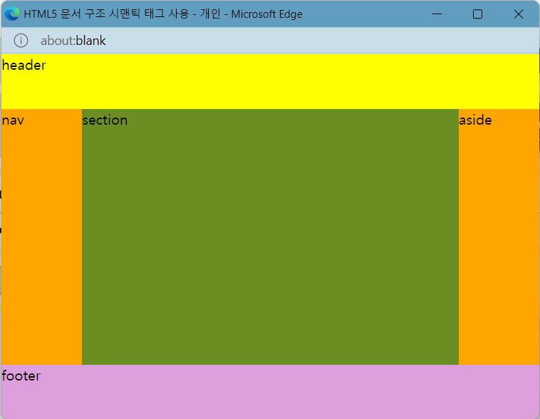
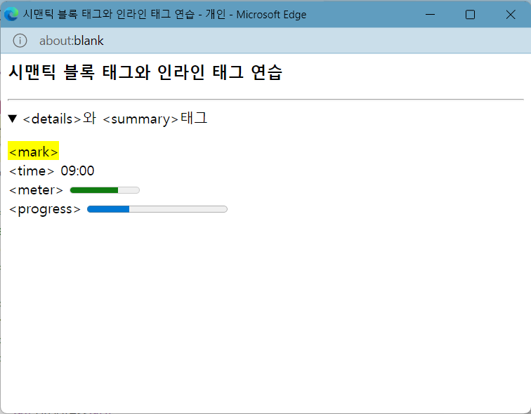
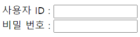

## HTML5의 문서 구조화, 시맨틱 웹

- 시맨틱 웹 : 웹 문서를 구조화하여 의미 있는 내용 탐색이 용이한 웹이다.
  * \<p>, \<div>, \<h1> 등 태그를 사용하는 HTML 기존 태그들은 문서의 구조나 의미 전달이 어렵다.
  * \<header>, \<section>, \<article>, \<main>, \<summary>, \<mark>, \<time> 같은 시맨틱 태그를 사용해 문서의 구조와 의미 전달을 용이하게 한다.

### 시맨틱 태그

- \<header> : 페이지나 섹션의 머리말 표현으로 페이지 제목, 페이지를 소개하는 간단한 설명이 있다.
- \<nav> : 하이퍼링크들을 모아 놓은 특별한 섹션으로, 페이지 내 목차를 만드는 용도이다.
- \<section> : 문서의 장(chapter, section)을 구성해 여러 \<section>이 가능하며, 헤딩 태그(\<h1>~\<h6>)를 사용하여 주제를 작성한다.
- \<article> : 블로그 포스트, 댓글 등 기타 독립적인 내용을 담는 부분으로 여러 \<section> 둘 수 있다.
- \<aside> : 본문에서 약간 벗어난 노트나 팁으로 페이지의 오른쪽이나 왼쪽에 주로 배치한다.
- \<footer> 저자나 저작권 정보 등이 있는 꼬리말 영역이다.
- 시맨틱 태그 사용으로 위치나 색, 모양이 자동으로 결정되지 않는다. 즉, CSS3을 이용해 위치와 색, 모양을 지정해야한다.

```HTML
<!--구조화된 HTML5 문서 작성과 CSS3 적용 예시-->
<head>
<style>
html, body { margin: 0; padding: 0; height: 100%; }
header {
	width: 100%; height: 15%; 
	background: yellow;
}
nav { 
	width: 15%; height: 70%; float: left;
	background: orange;
}
section {
	width: 70%; height: 70%; float: left;
	background: olivedrab;
}
aside {
	width: 15%; height: 70%; float: left;
	background: orange;
}
footer { 
	width: 100%; height: 15%; clear: both; 
	background: plum;
}
</style>
```


- \<figure>\</figure> : 본문에 사진, 차트, 소스 코드 등의 블록을 하나의 '그림'으로 묶는 블록 태그이다.
- \<details>\</details>, \<summary>\</summary> : \<details>는 정보를 열고 닫을 수 있는 상세 정보를 담는 시맨틱 블록 태그로 \<summary> 태그를 안에 작성해 블록의 제목을 작성한다.
- \<mark> 태그 : 하이라이팅(형광펜) 효과를 주는 시맨틱 인라인 태그이다.
- \<time> 태그 : 텍스트의 내용이 시간임을 표시하는 시맨틱 인라인 태그이다.
- \<meter> 태그 : 주어진 범위나 %의 데이터 량을 표시하는 시맨틱 인라인 태그이다.
- \<progress> 태그 : 작업의 진행 정도를 표시하는 시맨틱 인라인 태그이다.
```HTML
<!DOCTYPE html>
<html>
    <head>
        <meta charset="UTF-8">
        <title>시맨틱 블록 태그와 인라인 태그 연습</title></head>
    <body>
        <h3>시맨틱 블록 태그와 인라인 태그 연습</h3>
        <hr>
        <details>
            <summary>&lt;details&gt;와 &lt;summary&gt;태그</summary>
            <p><mark>&lt;mark&gt;</mark><br>
                &lt;time&gt; <time>09:00</time><br>
                &lt;meter&gt; <meter value="0.7" max="1.0">70%</meter><br>
                &lt;progress&gt;
                <progress value="3" max="10"></progress><br>
            </p>
        </details>
    </body>
</html>
```


### 웹 폼

- 웹 폼 : 로그인, 검색, 예약 등 웹 페이지에서 사용자 입력 받는 폼
- \<form>\</form> 태그 : 폼 작성할 때 이용하는 태그로 \<input>, \<textarea>, \<select> 등으로 구성
```HTML
<form name="폼의 이름"
      action="submit 누르면 지정된 웹 서버 응용프로그램(Java, PHP, C/C++ 등으로 작성)에 실행 요청"
      method="폼 데이터를 웹 서버로 전송하는 방식(GET 또는 POST)"
      enctype="폼 데이터를 웹 서버로 전송할 때 암호화 방식"
      target="웹 서버 응용 프로그램으로부터 받은 데이터를 출력할 윈도우 이름">
폼 구성 태그 작성
</form>
```

- \<input> : 사용자가 입력하는 부분을 처리하는 태그
```HTML
<form>
<input type="유형"
       name="요소 이름"
       maxlength="최대 입력 가능한 문자 개수"
       size="입력 창의 크기, 문자 개수"
       value="초기 텍스트">
폼 구성 태그 작성
</form>
```

- \<input> 태그의 id 속성  
  - 여러 번 사용된 폼 요소를 구분하기 위해 사용  
  - <label> 태그를 통해 캡션을 붙일 수 있으며, CSS를 이용해 원하는 형태로 꾸밀 수 있다.

- 폼 요소 종류
  - \<input type="text"> : 한 줄 텍스트 입력 창
  - \<input type="password"> : 한 줄 패스워드 입력 창(* 등 다른 문자로 출력)
  - \<input type="file"> : 로컬 컴퓨터의 파일 선택

- \<textarea> : 여러 줄 텍스트 입력가능한 태그 창

```HTML
<form>
<textarea cols="열 개수"
      rows="행 개수"
      name="요소 이름"
      wrap="자동 줄바꿈 처리 지정 : OFF/HARD/SOFT">
출력 텍스트 </textarea>
</form>
```

- \<datalist>\</datalist> : 목록 리스트를 작성하는 태그로 \<option> 태그로 여러 항목을 만든다.
```HTML
<form>
<!-- <datalist>에 선택한 값이 자동으로 <input type="text">의 텍스트 필드에 입력된다. -->
<input type="text" list="Name"><br>
<!-- list와 id값을 일치 시킨다. -->
    <datalist id="Name">
        <option value="Kim">
        <option value="Park">
        <option value="Choi">
    </datalist>
</form>
```
- 텍스트/이미지 버튼 : \<input type="button|reset|submit|image">이나 \<button> 태그를 이용한다.
```HTML
<input type="button|reset|submit|image(이미지 버튼)"
       name="버튼 이름"
       value="버튼에 출력되는 문자열"
       src="이미지 URL">

<button type="button|reset(입력 내용 전부 삭제)|submit(입력 내용 서버 전송)"
        name="버튼 이름"
        value="문자열">
버튼의 문자열이나 이미지
</button>
```

- 체크박스와 라디오버튼 : \<input type="checkbox|radio"> 태그를 이용한다.
```HTML
<input type="checkbox/radio"
       name="버튼 이름"
       value="체크박스/라디오버튼 요소 값"
       checked(초기에 선택 상태로 출력)>
```
- \<select> : 드롭다운 리스트를 가진 콤보박스 태그로 \<option> 태그로 여러 항목을 만든다.
```HTML
<select name="요소 이름"
        size="콤보박스 창에 보일 수 있는 항목 개수"
        multiple(다소 항목 선택 가능)>
    <option value="웹 서버에 전송되는 항목 값"
            selected(초기에 선택 상태로 출력)>
    </option>
</select>
```

- \<label> : 폼 요소과 캡션을 한 단위로 묶는 태그로, 캡션 텍스트를 명료하게 하는 장점이 있다.
```HTML
<label for="결합될 <input> 태그의 id 속성">

<label>
    사용자 ID : <input type="text" size="15" value="">
</label><br>
<label for="pass">비밀 번호 : </label>
<input id="pass" type="password" size="15" value="">
```



- 색 입력 폼 : \<input type="color"> 태그로 색 입력이 가능하다
```HTML
<input type="color" value="색 코드" onchange="선택한 색을 바탕색으로 지정">
```

- 시간 정보 입력 : \<input type="month|week|date|time|datetime-local"> 태그로 입력창을 만든다.
 - \<input type="month"> : 년/월(value="2022-03")
 - \<input type="week"> : 년/주(value="2022-W09")
 - \<input type="date"> : 년/월/일(value="2022-03-01")
 - \<input type="time"> : 시/분(value="21:30")
 - \<input type="datetime-local"> : 해당 나라의 시간(value="2022-03-01T21:30:10.32")
value 속성으로 시간 정보 입력 가능
내용을 입력하세요.
- 스핀 버튼과 슬라이드바 : \<input type="number|range"> 태그로 만들 수 있다.

```HTML
<input type="number(정교한 값)" min="최솟값" max="최댓값" step= "증감값">
<input type="range(대략적인 값)" min="최솟값" max="최댓값" list="연결할 데이터 리스트 id">
내용을 입력하세요.
- 형식을 가진 텍스트 입력 : <input type="email|url|tel|search"> 태그로 이메일, URL, 전화번호, 검색키워드 등 형식을 가진 텍스트를 입력할 수 있다.


<input type="email" placeholder="힌트값(id@host)">
<input type="url" placeholder="힌트값(http://)">
<input type="tel" placeholder="힌트값(010-1234-5678)">
<input type="search" placeholder="힌트값(검색어)">
```

- \<fieldset>\</fieldset>, \<legend>\</legend> : 폼 요소를 그룹으로 묶는 태그, \<legend> 태그로 그룹 제목을 정할 수 있다.


### 문서 구조화 순서
1) 웹 페이지 전체를 구조화하여 시맨틱 태그로 분할한다.
2) 전체 제목과 소개는 \<header> 태그로 작성한다.
3) 본문은 \<section>으로 묶고 본문 내 각 절이나 영역은 \<article>로 작성한다.
4) 링크나 메뉴들은 \<nav> 태그로 작성한다.
5) \<header>, \<section>, \<article>, \<aside> 등에 헤딩 태그(\<h1>~\<h6>)를 이용해 제목을 붙인다.
6) 배경 음악을 사용하면 \<audio> 태그를 \<header> 영역에 삽입한다.
7) 문서의 모양은 CSS3 스타일 시트로 꾸민다.