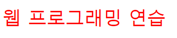
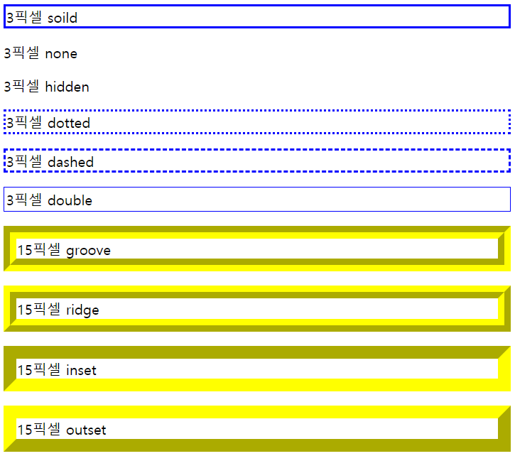

## CSS3 스타일 시트
- CSS(Cascading Style Sheet) : HTML 문서 색이나 모양 등 외관을 꾸미는 언어
- 스타일 시트(Style Sheet) : CSS로 작성된 코드

```CSS
/* 스타일 형식 */
p { text-align: center; }
/* p : 셀렉터, 괄호 안에 정의한 스타일 규칙이 적용될 대상 */
text-align: center; : 스타일 속성(프로퍼티)과 속성 값, 여러 개일 경우 세미콜론으로 구분
/* */ : 스타일 주석문
```

### 스타일 시트 만드는 방법

- \<style>\</style> 태그에 스타일 시트 작성 : \<head>\</head> 태그 안에서 \<style> 태그를 작성
```CSS
<head>
    <style>
        body { // body 태그에 적용
            background-color : linen;
            color : blueviolet;
            margin-left : 30px;
            margin-right : 30px;
        }
        h3 { // h3 태그에 적용
            text-align : center;
            color : darkred;
        }
    </style>
</head>
```

- HTML 태그 style 속성에 스타일 시트 작성 : style 속성 작성 후, 큰 따옴표로 스타일 시트를 묶는다.
```HTML
<p style="color:red; font-size:30px">웹 프로그래밍 연습</p>
```



- 스타일 시트를 별도 파일로 작성 : 여러 웹 문서에 사용할 스타일을 별도 파일로 저장하고 가져와 사용

```CSS
/* style.css */
h1 {
    color:blue;
}
p {
    font-size:1.2em; line-height:2.0;
    /* 줄 간격 */
}
```
```HTML
/* style 태그 없이 \<link> 또는 @import로 외부 스타일 시트 연결 */
<link rel="stylesheet" href="style.css"> // style 태그 없이 연결 가능
<style> @import url(style.css); </style>
```

### 스타일 상속

- 부모 태그 : 자신을 둘러싸는 태그
```HTML
<p style="color:green">부모 태그
    <em style=“font-size:25px”>자식 태그</em>
</p>
```

- 스타일 합치기와 오버라이딩 : 태그에 적용되는 모든 스타일이 합쳐지고, 동일한 스타일은 우선 순위대로 적용되는 규칙
- 태그에 적용 가능한 스타일 우선 순위
  - 중요도
  1. 사용자 스타일 시트의 중요 스타일(style 속성)
  2. 제작자 스타일 시트의 중요 스타일(\<style>\</style> 태그에 선언)
  3. 제작자 스타일 시트의 일반 스타일(style.css 파일)
  4. 브라우저 스타일 시트 스타일(기본 설정)
  - 명시도
  1. 인라인 스타일 : 해당 태그에만 적용되는 스타일
  2. id 스타일 : 지정한 부분에만 적용되는 스타일, 문서 안에서 한번만 사용
  3. 클래스 스타일 : 지정한 부분에만 적용되는 스타일, 문서 안에서 여러번 사용
  4. 태그 스타일 : 특정 태그에만 적용되는 스타일, 문서 안의 같은 태그에 모두 적용
  - 중요도와 명시도가 같은 경우 나중에 온 스타일이 먼저 온 스타일을 덮어쓴다.

### 셀렉터
- 셀렉터(Selector) : HTML 태그 모양을 꾸밀 스타일 시트 선택
```CSS
h2, li { color : blue; } 
/* 셀렉터와 같은 이름의(h2, li) 태그에 CSS3 스타일 시트 적용 */
```

- class 셀렉터 : . 으로 시작하는 이름의 셀렉터로 HTML 태그의 class 속성으로만 지정 가능하다.
```CSS
/* class 셀렉터 */
.warning { color : red; }
body.main { background : aliceblue; } // <body class="main"> 태그에만 적용된다.
```
```HTML
/* class 속성으로 지정 */
<body class="main">
    ...
    <div class="warning">주의!</div>
</body>
```

- id 셀렉터 : # 으로 시작하는 이름의 셀렉터로 HTML 태그의 id 속성으로만 지정 가능
```CSS
// id 셀렉터
#list { background : mistyrose; }
```
```HTML
// id 속성으로 지정
<ul id="list">
    <li>Park</li>
    <li>Lee</li>
    <li>Jeon</li>
</ul>
```

- class 셀렉터와 id 셀렉터의 차이
  - class 셀렉터는 문서 안에서 여러 번 사용 가능하다.
  - id 셀렉터는 문서 안에서 한 번만 사용 가능하다.

- 셀렉터 조합하기
  1) 2개 이상 셀렉터 조합 : 조합에 적합한 HTML 태그에만 적용
  2) 자식 셀렉터 : 부모 자식 관계인 두 셀렉터를 '>' 기호로 조합 ( div > strong { color:blue; } )
  3) 자손 셀렉터 : 자손 관계인 2개 이상 태그를 나열 ( ul strong { color:blue; } )

```CSS
/* section 요소 안의 모든 p 요소에 글자 색 지정 */
section p { color: blue; } 
/* section 요소 안의 p 요소 중 자식 p 요소에만 글자 색 지정 */
section > p { color: blue; }
```

- 전체 셀렉터 : 와일드 문자(*)를 사용해 모든 태그에 적용시킨다.
```CSS
/* 웹 페이지 모든 태그에 적용 */
* { color : green; } 
```

- 속성 셀렉터 : HTML 태그의 특정 속성 값이 일치하는 태그에만 스타일 적용
```CSS
/* <input>의 type 속성값이 text인 태그에만 적용 */
input[type=text] { color : red; } 
```

- 가상 클래스 셀렉터 : 어떤 조건이나 상황에 스타일을 적용하도록 만든 셀렉터
- 가상 클래스 셀렉터 유형
  - :hover : 마우스가 올라갈 때 스타일 적용
  - :active : 마우스를 누르고 있는 상황에 스타일 적용
  - :focus : 폼 요소가 키보드나 마우스 클릭으로 포커스 받을 때 스타일 적용
  - :link : 방문하지 않은 링크에 스타일 적용
  - :visited : 방문한 링크에 스타일 적용
  - :first-letter : 블록형 태그의 첫 글자에 스타일 적용
  - :first-line : 블록형 태그의 첫 라인에 스타일 적용
  - :nth-child(even) : 짝수 번째 모든 자식 태그에 스타일 적용
  - :nth-child(1) : 첫 번째 자식 태그에 스타일 적용

### 색 표현
- 16진수 코드로 표현 : #FF00FF
- 10진수 코드와 RGB() 표현 : rgb(255, 222, 255)
- 색 이름으로 표현 : blue
- 색 관련 스타일 속성(프로퍼티) : color / background-color / border-color


### 텍스트
- 들여쓰기 : text-intent:\<length>|\<percentage>;
- 정렬 : text-align:left|right|center|justify;
- 텍스트 꾸미기 : text-decoration:none|underline|overline|line-through

- CSS 표준 단위
  - em : 배수
  - % : 퍼센트
  - px : 픽셀 수
  - cm : 센티미터
  - mm : 밀리미터
  - in : 인치
  - pt : 포인터
  - pc : 피카소
  - deg : 각도

- 폰트 제어 스타일 속성(프로퍼티) : 폰트 패밀리, 폰트 크기, 폰트 스타일, 폰트 굵기 설정
```CSS
/* Arial -> Times New Roman -> Serif 순으로 폰트 설정 */
font-family : Arial, "Times New Roman", Serif

/* 40픽셀 */
font-size : 40px;
/* 중간 크기, 브라우저마다 다르다. */
font-size : medium;
/* 현재 폰트의 1.6배, 모바일 기기에 적합한 단위 */
font-size : 1.6em

/* 이탤릭 스타일 */
font-style : italic; 
/* 300정도 굵기(100~900) */
font-weight : 300;
/* 굵게(700) */
font-weight : bold;

/* 순서대로 지정하는 단축 프로퍼티 */
font : font-style, font-weight, font-size, font-family;
font : italic bold 40px consolas, sans-serif
```

### 박스 모델
- 박스 모델 : HTML 태그는 사각형 박스로 다루어지며, 박스 크기, 배경, 색, 여백, 옆 박스와의 거리 등 제어할 수 있다.
- 콘텐츠(content) : HTML 태그의 텍스트나 이미지가 출력되는 부분

```CSS
/* 콘텐츠 너비 */
width: 150px;
/* 콘텐츠 높이 */
height: 40px;
```

- 패딩padding : 콘텐츠를 직접 둘러싸는 내부 여백, 색은 따로 없으며 배경색으로 통일된다.

```CSS
/* 패딩 크기 관련 단축 프로퍼티(상하좌우 패딩 크기 20px) */
padding: 20px;
/* 위치 별 패딩 크기 조정 */
padding-top: 20px;
padding-left: 20px;
padding-right: 20px;
padding-bottom: 20px;
```
- 테두리border : 패딩 외부 테두리

```CSS
/* 테두리 크기 관련 단축 프로퍼티(상하좌우 테두리 크기 20px) */
border-width: 20px; 
/* 위치 별 테두리 크기 조정 */
border-top-width: 20px;
border-left-width: 20px;
border-right-width: 20px;
border-bottom-width: 20px;

/* 테두리 스타일 관련 단축 프로퍼티(상하좌우 테두리 스타일) */
border-style: none
/* 위치 별 테두리 스타일 조정 */
border-top-style: solid;
border-left-style: hidden;
border-right-style: dotted;
border-bottom-style: dashed;

/* 테두리 색 관련 단축 프로퍼티(상하좌우 테두리 색) */
border-color: red
/* 위치 별 테두리 색 조정 */
border-top-color: red
border-left-color: red
border-right-color: red
border-bottom-color: red

/* 테두리 전체 설정 관련 프로퍼티 */
border: 15px outset yellow
```


- 여백(margin) : 인접한 태그 박스와의 거리, 여백은 투명이다.
```CSS
/* 여백 크기 관련 단축 프로퍼티(상하좌우 여백 크기 20px) */
margin-width: 20px;
/* 위치 별 여백 크기 조정 */
margin-top : 20px;
margin-left : 20px;
margin-right : 20px;
margin-bottom : 20px;
```

- 테두리 모서리 둥글게 만들기 : border-radius 프로퍼티를 이용한다.
```CSS
/* 전체 모서리 50px 만큼 둥글게 만든다. */
border-radius : 50px; 
/* 왼쪽 위부터 시계 방향 순으로 적용 */
border-radius : 0px 20px 40px 60px;
```

- 이미지 테두리 만들기
```CSS
/*
url("이미지 주소") : 사용할 이미지 URL
30 : 이미지에서 30픽셀만큼 조각을 떼어 모서리에 배치
모서리 이미지를 제외한 나머지 이미지(에지 이미지) 반복 방식
   - round : 테두리 길이에 맞춰 에지 이미지 반복 배치
   - repeat : 에지 이미지 반복 배치(이미지가 잘릴 수 있음)
   - stretch : 에지 이미지를 테두리 길이만큼 늘여 배치
*/
border-image : url("이미지 주소") 30 round;
```

- 배경 색이나 이미지 지정 : background-color, background-image
- 배경 이미지의 위치 : background-position
- 배경 이미지 반복 출력 : background-repeat
- 배경 전체 설정 단축 프로퍼티 : background
```CSS
background-color : blue;
background-size : 100px 100px;
background-image : url("이미지 파일");
background-repeat : no-repeat/repeat-y;
background-position : top/left/right/bottom/center;

background : skyblue url("이미지 파일") center center/100px 100px repeat-y;
```