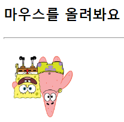

### 1. 다음 중 HTML 태그에 대한 브라우저의 디폴트 배치는?
1. 정적 배치
2. 상대 배치
3. 절대 배지
4. 고정 배치

> 답 : 1

### 2. CSS3에서 배치의 의미를 잘 설명한 것은?
1. HTML 태그는 웹 페이지에 작성된 순서로 배치된다는 의미
2. HTML 태그를 개발자가 원하는 위치에 임의로 배치할 수 있다는 의미
3. HTML 태그는 항상 보이게 배치된다는 의미
4. HTML 태그를 특정 위치에 고정시켜 배치할 수 없다는 의미

> 답 : 2  
> 1번은 normal flow에 대한 설명  

### 3. 다음 HTML 소스와 브라우저의 출력 결과를 참고하여 빈칸에 CSS3 스타일을 삽입하라

  
> 답 : inline-block, width:100px, inline-block, height:100px

```JavaScript
p {
    border : 2px solid yellowgreen;
    color : blue;
    background : aliceblue;
}
<div>
    <p style="display : inline-block; height : 100px; width : 100px"> 학생 여러분을 정말로 사랑합니다. 특히 1학년을. </p>
    <p style="display : inline-block; height : 100px; width : 100px"> 물론 3, 4 학년 학생 여러분도 무척 사랑하지요!</p>
</div>
```

### 4. \<span>SPAN\</span>과 \<div>DIV\</div>에 대한 설명으로 틀린 것은?

1. \<span> 태그는 디폴트로 인라인 박스로 다루어진다.
2. \<div>는 \<div style="display:inline-block">DIV\</div>와 동일하다.
3. \<span>은 \<span style="display:inline">SPAN\</span>과 동일하다.
4. \<span> 태그가 차지하는 영역의 높이는 조절할 수 없지만 \<div> 태그가 출력되는 영역의 높이는 조절할 수 있다. 

> 답 : 2  
> \<span> : 인라인 박스, \<div> : 블록 박스  
> \<div>는 \<div style="display:block">DIV\</div>와 동일

### 5. 다음 HTML 태그에 대해, CSS3 스타일이 주어지는 각 경우 출력되는 결과를 그려보라. 브라우저를 옆으로 충분히 늘렸을 경우이다.__

```HTML
<p>
    <div>hello1</div>
    <div>hello2</div>
    <div>hello3</div>
</p>
```


- div { border : 1px solid blue; width : 100px }
> 답 :  
> 
- div { display : inline; border : 1px solid blue; width: 100px }
> 답 :  
> 
- div { display : inline-block; border : 1px solid blue; width : 100px }
> 답 :  
> 

### 6. 다음 각 항목에 지시한대로 \ 태그에 적용할 셀렉터와 CSS3 스타일 시트를 작성하라.

- 웹 페이지의 모든 이미지를 보이지 않게 한다.
> 답 : img { display : none; or visibility : hidden }

- 웹 페이지의 모든 이미지는 한 라인에 하나씩만 출력한다.
> 답 : img { display : block } 

- 웹 페이지의 모든 이미지의 크기는 400x300(픽셀)로 출력한다.
> 답 : img { width : 400px ; height : 300px }

### 7. 웹 페이지에 작성된 암호 입력 창(\<input type="password">)의 배경색을 노란색으로 칠하는 CSS3 스타일 시트는 무엇인가?

1. input[type:password] { background : yellow }
2. input[type=password] { background : yellow }
3. #input[type:password] { background : yellow }
4. :input[type=password] { background : yellow }

> 답 : 2

### 8. 다음 질문에 적합한 셀렉터와 CSS3 스타일 시트를 작성하라.

- 웹 페이지내 모든 \<input type="button"> 버튼의 글자 색을 파란색으로 칠한다.
> 답 : input[type=button] { color : blue }

- 웹 페이지내 모든 \<input type="button"> 태그를 가진 모든 버튼에 대해, 마우스가 올라갈 때만 배경색을 노란색으로 칠한다.
> 답 : input[type=button]:hover { background : yellow }

- 웹 페이지내 \<input type="button"> 버튼에 대해, 마우스로 클릭하면 배경색을 노란색으로 칠한다. 그 후 사용자가 마우스로 다른 곳을 클릭하면 원래대로 돌아온다.
> 답 : input[type=button]:focus { background : yellow }

### 9. 다음 전환(transition)이 일어나도록 CSS3 스타일 시트를 작성하라.

- \<span> 태그의 텍스트 크기를 지정하는 font-size 프로퍼티가 변경되면 2초에 걸쳐 천천히 텍스트의 크기가 변한다.
> 답 : span { transition : font-size 2s }

- \ 태그의 폭을 지정하는 width 프로퍼티가 변경되면, 3초에 걸쳐 천천히 이미지 폭이 변한다.
> 답 : img { transition : width 3s }

### 10. 다음과 같은 HTML 태그와 출력된 모양이 있다. 스폰지밥 이미지에 마우스를 올렸을 때 주어진 문항과 같이 변환되도록 transform 프로퍼티 등을 이용하여 \<style> 태그 안에 들어가 시트를 완성하라.

```HTML
<h3>마우스를 올려봐요</h3>
<hr>

```

- 180도 회전  


```HTML
답 :
<style> 
    #tran:hover {
        transform : rotate(180deg);
    }
</style> 
```

- y축으로 -20도 기울임  


```HTML
답 :
<style> 
    #tran:hover {
        transform : skewY(-20deg);
    }
</style> 
```

- 90도 회전하고 1:3 비율 확대  
 

```HTML
답 :
<style>
    #tran:hover {
        transform : rotate(90deg) scale(1,3);
    }
</style> 
```