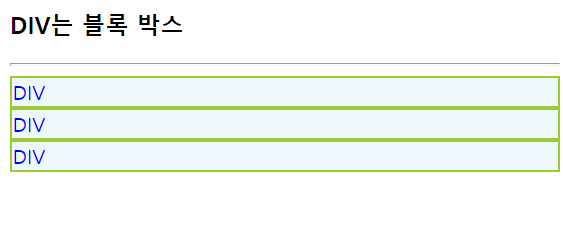
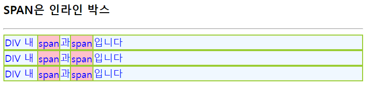
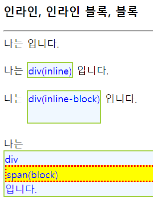
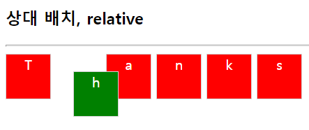
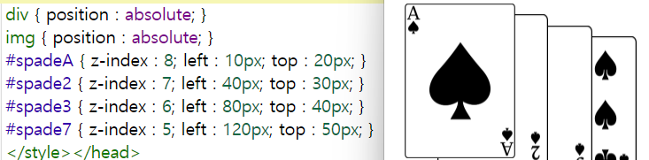
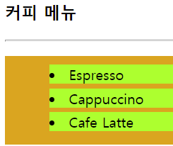

## 배치
- CSS3으로 HTML 태그가 출력되는 위치를 원하는 곳에 지정

### 블록 박스와 인라인 박스
- HTML 태그는 인라인 태그와 블록 태그로 분류하며, 인라인 태그는 인라인 박스, 블록 태그는 블록 박스로 출력

```HTML
<!--블록 박스-->
<div>DIV</div>
<div>DIV</div>
<div>DIV</div>
```


```HTML
<!--인라인 박스-->
<div>DIV 내 <span>span</span>과<span>span</span>입니다</div>
<div>DIV 내 <span>span</span>과<span>span</span>입니다</div>
<div>DIV 내 <span>span</span>과<span>span</span>입니다</div>
```


### CSS3 위치 설정

- display : 태그를 박스로 지정
- block(블록 박스)
  - 항상 새 라인에서 시작
  - 블록 박스 내에만 배치
  - 옆에 다른 요소 배치 불가능
  - width와 height으로 크기 조절 가능
  - padding, border, margin 조절 가능
```CSS
span { 
    display : block;
}
```

- inline
  - 기존 라인 안에 존재
  - 보든 박스 내 배치 가능
  - 옆에 다른 요소를 배치할 수 있음
  - width와 height으로 크기 조절 불가능
  - margin-top, margin-bottom 조절 불가능
```CSS
div div {
    display : inline;
}
```
- inline-block
  - inline
    - 기존 라인 안에 존재
    - 보든 박스 내 배치 가능
    - 옆에 다른 요소를 배치할 수 있음
  - block
    - width와 height으로 크기 조절 가능
    - padding, border, margin 조절 가능
```CSS
div div {
    display : inline-block;
}
```

- none : 적용된 태그는 공간 자체도 없어짐
```CSS
img {
    display : none;
}
```


- 배치
  - 웹 페이지에 나타난 순서대로 HTML 태그 배치하는 방식인 normal flow를 position을 이용해 무시할 수 있음
  - static : 정적 배치(디폴트값)
  - relative : 상대 배치, 상대 배치에 따라 위치 지정
  - absolute : 절대 배치, 절대적인 위치 지정
  - fixed : 고정 배치, 브라우저 크기까지 고려해 위치 지정
  - float : 유동 배치, 브라우저 크기까지 고려해 위치 지정
    - float : left, float : right가 있음
  - position 프로퍼티를 사용할 경우, 태그의 위치와 크기
    - top, bottom, left, right, width, height  



- z-index : z축 우선 순위 지정

```CSS
#spadeA { z-index : -3; left : 10px; top : 20px; }
#spade2 { z-index : 2; left : 40px; top : 30px; }
```
### CSS3 텍스트 설정



- visibility : 공개 여부 지정, 적용된 텍스트는 공간을 차지하나 공개 여부에 따라 보여지거나 보여지지 않을 수 있음

```CSS
span { 
    visibility : hidden;
}
```

- overflow
  - hidden : 박스를 넘어가면 내용 숨기기
  - visible : 박스를 넘어가서도 내용 출력
  - scroll : 박스에 스크롤바 생성

- list-style-type : 아이템 마커 타입 지정
  - none, disc(●), circle(○), square(■), decimal(1)
- list-style-image : 아이템 마커 이미지 지정
  - list-style-image : url("이미지 주소");
- list-sytle-position : 아이템 마커 출력

```CSS
ul { 
    background : goldenrod;
    padding : 10px 10px 10px 50px;
    list-style-position : inside;
}
```


- list-style : 위 3개 모두 지정

### CSS3 표 설정

- border : 표 테두리 설정
- border-collapse : collapse; : 중복된 테두리 합치기
- width, height으로 셀 크기를 제어할 수 있음
- padding : 여백 설정
- text-align : 정렬 설정(left, center, right)
- background : 배경색 설정
- color : 표 텍스트 색 설정
- border-bottom : 테두리 설정

```CSS
thead { /* <thead>의 모든 셀 적용 */
  background : darkgray;
  color : yellow;
}
td, tfoot th { /* 아래쪽 테두리만 회색 */
  border-bottom : 1px solid gray
}
```

- tbody tr:nth-child(even) : \<tbody>에 있는 짝수 \<tr>에 표 꾸미기

 ### CSS3 폼 설정
 - input[type=타입]
   - color : 폼 요소 글자 색 지정
   - border : 폼 요소 테두리 만들기
     - border-radius : 테두리 모서리 설정
   - :hover : 마우스 올라올 때 설정
   - :focus : 포커스를 받을 때 설정

```CSS
input[type=button]:hover { background : yellow }
```

### CSS3 동적 변화 설정

- CSS3로만 HTML 태그 모양의 동적 변화 가능
- 애니메이션
  - @keyframes으로 HTML 태그의 시간별 모양 변화 만들기

```CSS
 /* @keyframes으로 HTML 태그의 시간별 모양 변화 만들기 */
@keyframes textColorAnimation {
  0% { color : blue; } /* 시작 시. 0% 대신 from 사용 가능 */
  30% { color : green; }
  100% { color : red; } /* 끝까지. 100% 대신 to 사용 가능 */
}

/* 애니메이션 스타일 시트 */
span {
animation-name : textColorAnimation; 
animation-duration : 5s; /* 애니메이션 1회 지속 시간 */
animation-iteration-count : infinite; /* 무한 반복 */
}
```

### 전환

- HTML 태그에 적용된 CSS3 프로퍼티 값의 변화를 서서히 진행시
켜 애니메이션 효과 생성
- HTML 태그의 색이나 모양, 위치 등이 서서히 변하는 효과
- transition을 이용해 전환 설정

```CSS
span {
  transition : font-size 5s;
} 
span:hover {
  font-size : 500%;
}
```

### 변환
-  텍스트나 이미지를 회전, 확대 다양한 기하학적인 모양
으로 출력
  - 회전 각도의 단위는 deg이며 시계방향의 회전
  -  텍스트나 이미지를 회전, 확대 다양한 기하학적인 모양으로 출력
-  transform을 이용해 변환 설정
   - translate(x,y) : x축, y축만큼 이동
   - translateX(n) : x축으로 n만큼 이동
   - translateY(n) : y축으로 n만큼 이동
  - scale(w,h) : 폭과 높이를 w, h배만큼 조절, 0으로 설정할 경우 보이지 않음
  - scaleX(n) : 폭을 n배만큼 조절
  - scaleY(n) : 높이를 n배만큼 조절
  - rotate(angle) : angle 각도만큼 시계 방향 회전
  - skew(x-angle, y-angle) : x축과 y축을 기준으로 x-angle, y-angle 각도만큼 기울임
  - skewX(angle) : x축을 기준으로 angle 각도만큼 기울임
  - skewY(angle) : y축을 기준으로 angle 각도만큼 기울임

```CSS
div {
  transform : rotate (20deg); /* # 20도 회전 */
}
```