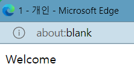
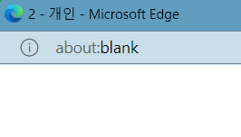

### 1. 자바스크립트의 특징이 아닌 것은?
1. 자바스크립트 프로그램은 컴파일 과정이 간단한다.
2. 자바스크립트 프로그램은 HTML 페이지에 소스 코드 형태로 삽입된다.
3. Netscape사가 처음 개발하였다.
4. 웹 페이지에 동적인 변화를 만드는데 사용된다. 

> 답 : 1  
> JavaScripts는 컴파일이 필요 없음

### 2. 자바스크립트 언어로 할 수 없는 것은?
1. 사용자로부터 마우스나 키 입력을 처리할 수 있다.
2. 새 브라우저 윈도우를 생성할 수 있다.
3. 로컬 컴퓨터의 파일을 삭제할 수 있다.
4. CSS3 프로퍼티 값을 변경하여 HTML 태그의 모양을 동적으로 바꿀 수 있다.

> 답 : 3  

### 3. 다음 중 리터럴이 아닌 것을 찾아라.

> 0, 12.34, "a", Oxff, ff, null, false, "hello", 4+5

> 답 : ff, 4+5

### 4. 3/2+"px"의 연산 결과는 무엇인가?

1. "1px" 
2. "2px" 
3. "1.5px" 
4. "3/2px" 

> 답 : 3

### 5. 자바스크립트 언어의 구문이 아닌 것은? 

1. break
2. loop 
3. switch 
4. continue

### 6. case 문으로 잘못 사용한 것은?

1. case 3 : 
2. case "s" : 
3. case 3+2 : 
4. case x>6 :

> 답 : 4

### 7. 다음 문장의 실행 결과 w, x, y, z의 값은 무엇인가?

```JavaScript
let x=1, y=2, z=3, w=4;
y = x++;
z += x;
w = (w > 3) ? w-3 : 3-w;
```
> 답 :  
> x=1  
> y=1  
> z=4  
> w=1 

```JavaScript
let a=1, b=2, c=3, d=4;
let x = (a > 1) || (c != 3);
let y = (a != b) && (c != d);
let z = b << c;
let w = (a == 1)
```
> 답 :  
> x=false  
> y=true  
> z=16  
> w=true 

### 8. 다음 문장의 실행 결과 s, t의 값은 무엇인가?

```JavaScript
let s = 1 + 2 + "hello" + 3;
let t = 1 + "hello" + 2 + 3;
```
```
답 : 
3hello3
1hello23
```

```JavaScript
let s = ("hello" > "javascript");
let t = ("아버지" > "어머니"); 
```
```
답 :
false
false
```

### 9. 다음 코드에서 지역 변수와 블록 변수 그리고 전역 변수를 찾아 나열하라.

```JavaScript
let x;
function f() {
    let y = x + 5;
    z = y + 5;
    return z;
}
```
```
답 :
지역 변수 : y
전역 변수 : x, z
블록 변수 : 없음
```

```JavaScript
sum = 0;
function f() {
    let x = 1;
    for(let n = 0; n < 5; n++)
        sum += x;
}
```
```
답 :
지역 변수 : 없음
전역 변수 : x, sum
블록 변수 : n
```

### 10. 다음 코드의 실행 결과 출력되는 내용은 무엇인가?

```JavaScript
let sum = 0;
function acc() {
    let sum = 0;
    for (let i = 0; i < 10; i++)
        sum += i;
}

acc();
document.write("합 = " + sum)
```
> 답 : 0

```JavaScript
var sum = 0;
function acc() {
    var sum = 0;
    for (let i = 0; i < 10; i++)
        this.sum += i;
}

acc();
document.write("합 = " + sum)
```
> 답 : 45

### 11. 다음 시가를 경과가 틀린 것은? 
1. 53+10=63
2. 53/10=5
3. 53%10=3
4. 53*10=530 

> 답 : 2  
> 나누기 연산을 하면 실수가 나옴

### 12. 다음 웹 페이지가 출력되는 모양을 그려라.

```HTML
<!DOCTYPE html>
<html>
<head>
    <meta charset="UTF-8">
    <title>1</title>
</head>
<body>
    <script>
        document.write("Welcome");
    </script>
</body>
</html>
```
> 답 :


```HTML
<!DOCTYPE html>
<html>
<head>
    <meta charset="UTF-8">
    <title>2</title>
</head>
<body>
    <script>
        function print() {
            document.write("Welcome<br>");
        }
    </script>
</body>
</html>
```
> 답 :


### 13. 다음과 같이 변수 a, b가 선언되어 있을 때, 각 계산 후 a, b값은 무엇인가?

```JavaScript
let a=20, b=2;
```

- a += b;
> 답 : a = 22, b = 2
 
- a = a << b;
> 답 : a = 80, b = 2

- a = (a > 100) ? a : b; 
> 답 : a = 2, b = 2

- b = (a > 10) && (a < 30);
> 답 : a = 20, b = true

### 14. 다음과 같이 변수 a, b가 선언되어 있을 때, 각 계산 후 a, b 값은 무엇인가?

```JavaScript
let a="123", b="45";
```

- a += b;
> 답 : a = "12345", b = "45"
 
- a = parseInt(a) + parseInt(b);
> 답 : a = 168, b = "45"

- a = 10 + a : b;
> 답 : a = "1012345", b = "45"

- b = 10 + parseInt(a) + "ab";
> 답 : a = "123", b = "133ab"