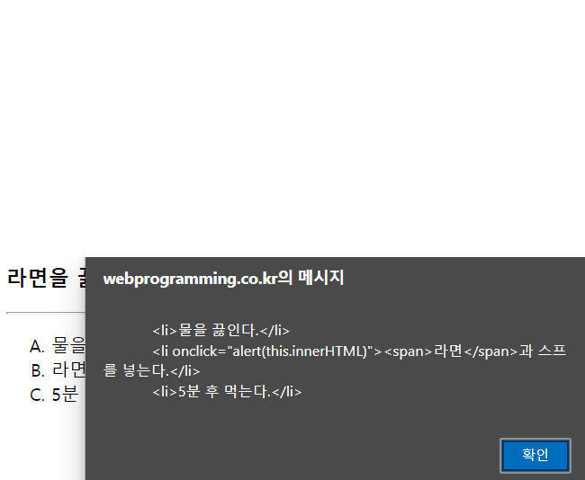

### 1. 다음 중 DOM 객체는?
1. window 객체
2. navigator 객체 
3. event 객체 
4. html 객체

> 답 : 4

### 2. 다음 중 DOM 객체가 아닌 것은? 
1. p 객체 
2. document 객체 
3. div 객체 
4. span 객체

> 답 : 2  
> document 객체는 DOM 객체에 접근하기 위함

### 3. HTML DOM 트리에 대해 잘못 말한 것은?
1. 브라우저에 의해 만들어진다. 
2. HTML 문서가 로드되면 만들어진다.
3. HTML 태그의 포함 관계에 의해 DOM 객체들 사이에 부모 자식 관계가 형성된다.
4. DOM 트리에서 DOM 객체를 찾는 기능은 window.getElementById()이다.

> 답 : 4  
> DOM 트리에서 DOM 객체를 찾는 것은 document.getElementsByTagName()과 document.getElementsByClassName()

### 4. 브라우저가 HTML DOM 트리를 만드는 목적은 무엇인가?

> 답 : JavaScript에서 DOM 객체에 접근하기 위함
> HTML DOM 트리를 만드는 이유는 HTML 문서의 각 요소를 객체화하고 이 객체들을 계층관계로 연결하
여 유지함으로써, HTML 페이지가 로드된 이후 자바스크립트 코드로 HTML 태그 요소를 접근하고 동
적인 변화를 줄 수 있도록 하기 위해서이다. 또한 HTML 페이지가 이미 로드된 이후에도 DOM 트리에 
새로운 HTML 요소를 삽입하거나 삭제하여 출력된 웹 페이지의 모양을 제어하기 위해서이다. 

### 5. 다음은 웹 페이지에 작성된 \<div id="myADiv">...\</div> 태그를 찾는 자바스크립트 코드이다.

```JavaScript
let obj = document.getElementById("myDiv");
```
- 이 \<div> 태그의 모양을 제어하기 위해 잘못 사용한 것은?

1. obj.style.zIndex = 4;
2. obj.style.backgroundcolor = "red";
3. obj.style.margin = "10px";
4. obj.style.fontSize = "10px";

> 답 : 2  
> obj.style.backgroundColor = "red";

### 6. 다음 중 document 개체의 메소드 이름이 잘못된 것은?
1. getElementById() 
2. getElementByTagName()
3. writeln() 
4. getElementsByClassName()

> 답 : 2  
> getElementByTagName() -> getElementsByTagName()

### 7. 다음 웹 페이지에 대해 물음에 답하라. 

```HTML
<!DOCTYPE html>
<html>
    <head> <meta charset="UTF-8">
        <title>라면을 끓이는 순서</title>
    </head>
    <body>
        <h3>라면을 끓이는 순서</h3>
        <hr>
        <ol type="A">
            <li>물을 끓인다.</li>
            <li onclick="alert(this.innerHTML)"><span>라면</span>과 스프를 넣는다.</li>
            <li>5분 후 먹는다.</li>
        </ol>
    </body>
</html>                
```

- 라인 9의 \<li> 태그에 의해 생성된 DOM 객체의 innerHTML 프로피티 값은 무엇인가? (웹 페이지를 출력하고 라인 9를 클릭하면 확인해 볼 수 있다.)

> 답 :  \<span>라면\</span>과 스프를 넣는다

- 라인 7을 \<ol type="A" onclick="alert(this.innerHTML)">로 수정하여 웹 페이지를 출력하고 라인 8이나 10의 위치에 클릭하면 무엇이 출력되는가?

```HTML
<!DOCTYPE html>
<html>
    <head> <meta charset="UTF-8">
        <title>라면을 끓이는 순서</title>
    </head>
    <body>
        <h3>라면을 끓이는 순서</h3>
        <hr>
        <ol type="A" onclick="alert(this.innerHTML)">
            <li>물을 끓인다.</li>
            <li onclick="alert(this.innerHTML)"><span>라면</span>과 스프를 넣는다.</li>
            <li>5분 후 먹는다.</li>
        </ol>
    </body>
</html>  
```

> 답 :   
> \<li>물을 끓인다.\</li>, \<li>5분 후 먹는다.\</li> 클릭 시 화면

### 8. 다음 위 페이지를 로드하면 경고창이 출력되는가? 답에 대한 이유를 설명하라. 

```HTML
<!DOCTYPE html>
<html>
    <head> <meta charset="utf-8"> 
        <title>자바스크립트 테스트</title>
        <script>
        let elem = document.getElementById("myBody");
        if(elem == null)
            alert("body is not made yet");
        </script>
    </head>
    <body id="myBody">
        <p id="first">hello</p>
    </body>
</html>
```

> 답 : alert() 함수가 실행되고 경고창이 출력된다. 그 이유는 HTML 문서가 로딩되는 초기에 <script>
내의 let elem = document.getElementById("myBody");코드가 실행된다, 하지만 아직 브라우저
는 <body>...</body> 태그를 읽지 못한 상태이며 따라서 body 객체가 생성되지 않았다. 그러므로 
document.getElementById("myBody") 메소드가 null을 리턴하여 if(elem == null)의 조건문이 
true가 되고 alert() 함수가 실행된다.

### 9. HTML 페이지에 다음 태그가 작성되어 있을 때

```HTML
<div id="myDiv"></div>
```
- 다음 코드를 작성하여 div 태그가 출력되는 영역에 "\<span>hello\</span>"을 삽입하여 hello를 출력시키고자 한다. 빈 칸을 완성하라.

```JavaScript
let div = document.getElementById("myDiv"); // id가 myDiv인 DOM 객체를 알아냄
let span = document.createElement("span"); // <span> 태그를 나타내는 DOM 객체 동적 생성
span.innerHTML = "hello"; // "hello"를 <span> 태그의 텍스트를 삽입
div.appendChild(span); // span을 div의 자식으로 삽입
```